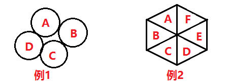
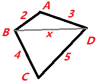
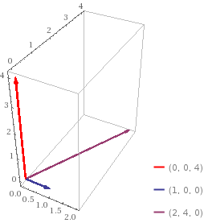
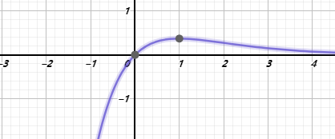
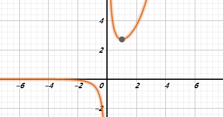
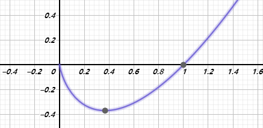
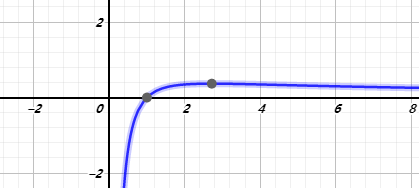
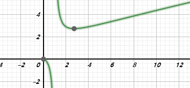
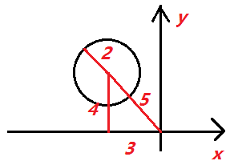

# 数学
[TOC]
## 结论

#### 1，不定积分

$\int e^{mx}dx=\frac{1}{m}e^{mx}$

$\int \cos(\omega x)dx=\frac{1}{\omega}\sin(\omega x)$

$\int \sin(\omega x)dx=-\frac{1}{\omega}\cos(\omega x)$

$\int a^xdx=\frac{a^x}{\ln a}$

#### 2，单词拼写错误的种数

###### 例1

$school$ 的错误拼写有多少种？

**分析：**

因为单词中有6个字母，除了2个字母 $o$ 以外，其余的字母各不相同，所以种数为
$$
\frac{\rm{A}^6_{6}}{2!}-1=359
$$
其中的式子除以 $2!$ 是因为要排除重复的2个字母 $o$ ，而减1是因为正确拼法只有一种，要排除本身的正确拼法。

#### 3，独立性检验中关系性最强

$$
K^2=\frac{n(ad-bc)}{(a+b)(c+d)(a+c)(b+d)}
$$

$$
n=a+b+c+d
$$

**当 $|ad-bc|$ 越大，关系性越强。**

#### 4，环状相邻区域的涂色问题

###### 例1

如图所示，你有4种颜色的颜料，现在需要将每个圆上色，要求相邻的圆颜色不同，则有多少种不同涂色方式？

**分析：**

① 若A,C同色，涂A有4种，涂B和D都有3种，C颜色与A一样，涂C只有一种，所以有 $4\times3\times3=36$ 种

② 若A,C不同色，涂A,C从4个里选2个排列，涂B,D都有2种，所以有 $\rm{A}_4^2\times2\times2=48$ 种

所以共有 $36+48=84$ 种

**组合学问题要正确把握好分类和分步**，如先涂后涂就是分步，用乘法计数，而分类讨论A,C是否同色就是分类，用加法计数。

###### 例2

如图所示，你有4种不同颜色，将每个三角形区域上色，要求相邻区域的颜色不同，则有多少种不同涂色方式？

**分析：**

① 若F,C同色，有 $4\times(3\times2)^2=144$ 种

② 若F,C不同色，有 $\rm{A}_4^2(3+2\times2)^2=588$ 种

所以共有 $144+488=732$ 种

归纳推广之，得到结论

m种不同颜色，n个环状相邻区域，相邻区域颜色不同，不同涂色种类数为
$$
(m-1)^n+(m-1)\times(-1)^n\\
n\ne1,2,3,\cdots,m-3
$$
4种颜色时，种类数为
$$
\left\{
\begin{aligned}
3^n+3\times(-1)^n&,n\geqslant2\\
4&,n=1
\end{aligned}
\right.
$$

#### 5，二次分式的最值问题

###### 结论

设 $m,n,a,b>0$ 

若 $x>y$ 则  
$$
\frac{ma^2+nb^2+xab}{ma^2+nb^2+yab} \leqslant \frac{2\sqrt{mn}+x}{2\sqrt{mn}+y}
$$

若 $x<y$ 则  
$$
\frac{ma^2+nb^2+xab}{ma^2+nb^2+yab} \geqslant \frac{2\sqrt{mn}+x}{2\sqrt{mn}+y}
$$

###### 证明  
$$
\frac{ma^2+nb^2+xab}{ma^2+nb^2+yab} = 1+\frac{x-y}{\frac{ma}{b}+\frac{nb}{a}+y}
$$
然后分类讨论 $x$ 与 $y$ 的大小关系，利用基本不等式可以得到以上结论。

###### 例1
若实数 $x,y$ 满足 $4x^2-5xy+4y^2=5$ ，则 $x^2+y^2$ 的最大值为多少？

由以上结论可得
$$
\frac{4x^2+4y^2}{4x^2+4y^2-5xy} \leqslant \frac{2\sqrt{4 \times 4}+0}{2\sqrt{4 \times 4}-5} = \frac{8}{3}
$$
即  
$$
\frac{4(x^2+y^2)}{5} \leqslant \frac{8}{3}
$$
故
$$
x^2+y^2 \leqslant \frac{10}{3}
$$

###### 例2
若实数 $x,y$ 满足 $x^2+y^2+xy=1$ ，则 $x+y$ 的最大值为多少？

由以上结论可得
$$
x+y \leqslant  \sqrt{x^2+y^2+2xy} = \sqrt{\frac{x^2+y^2+2xy}{x^2+y^2+xy}} \leqslant \sqrt{\frac{2+2}{2+1}}=\frac{2\sqrt{3}}{3}
$$

#### 6，非直角三角形中的正切值

###### 结论

在非直角三角形中，三个角依次是 $A,B,C$ 有下述等式恒成立
$$
\tan A+\tan B+\tan C=\tan A\tan B\tan C
$$

###### 证明

$$
\begin{align*}
\tan A+\tan B+\tan C&=\tan A+\tan B+\tan[\pi-(A+B)]\\
 &=\tan A+\tan B-\tan(A+B)\\
 &=\tan A+\tan B-\frac{\tan A+\tan B}{1-\tan A\tan B}\\
 &=(\tan A+\tan B)(1-\frac{1}{1-\tan A\tan B})\\
 &=(\tan A+\tan B)(\frac{-\tan A\tan B}{1-\tan A\tan B})\\
 &=\tan A\tan B\cdot\frac{-(\tan A+\tan B)}{1-\tan A\tan B}\\
 &=\tan A\tan B\cdot(-\tan(A+B))\\
 &=\tan A\tan B\tan[\pi-(A+B)]\\
 &=\tan A\tan B\tan C
\end{align*}
$$

###### 例1

在非直角三角形中，三个角依次是 $A,B,C$ ，若 $\tan A=1，\tan B=2$，求 $\tan C$

**分析：**

依据上述结论，可得方程 $3+\tan C=2\tan C$，解得 $\tan C = 3$

#### 7，点关于直线对称

###### 结论

点 $(x_0,y_0)$ 关于直线 $Ax+By+C=0$ 对称的点为 $(x,y)$，则
$$
x=x_0-2A\frac{Ax_0+By_0+C}{A^2+B^2}\\
y=y_0-2B\frac{Ax_0+By_0+C}{A^2+B^2}
$$

###### 反解法

是上述结论的一个特例，是考题中最经常出现的一种。

若点 $(x_0,y_0)$ 关于直线 $x\pm y+m=0$ 对称的点为 $(x,y)$ 则满足
$$
x_0\pm y+m=0\\
x\pm y_0+m=0
$$
简单点来说，若一个点关于斜率为 $\pm 1$ 的直线对称，把这个点的横坐标代入直线方程解得纵坐标，反之也成立。

###### 例1

求点 $(2,3)$ 关于直线 $x+y+2=0$ 对称的点的坐标

**分析：**

$2+y+2=0$ 得 $y=-4$，$x+3+2=0$ 得 $x=-5$，所以对称的点坐标为 $(-5,-4)$

#### 8，四边形面积最大值

###### 例1

已知平面图形 $ABCD$ 为凸四边形，且 $AB=2,BC=4,CD=5,DA=3$，求 $ABCD$ 面积 $S$ 的最大值

**分析：**

根据题意可作出下图

在 $\triangle ABD$ 和 $\triangle CBD$ 中分别使用公式 $S=\frac{1}{2}ab\sin C$ 可得四边形面积为 $S=3\sin A+10\sin C$

在 $\triangle ABD$ 和 $\triangle CBD$ 中分别使用余弦定理可得等式 $7=-3\cos A+10\cos C$

两式平方再相加得 $S^2+49=109-60\cos(A+C)$

当对角互补时，即 $A+C=\pi$ 时，有面积最大值 $S=2\sqrt{30}$

**推广之**

四边形的边长分别为 $a,b,c,d$，四边形的面积最大值为 $S$，则有
$$
S=\sqrt{(p-a)(p-b)(p-c)(p-d)}\\
p=\frac{a+b+c+d}{2}
$$
**特例**

当 $a+b=c+d$ 或 $a+c=b+d$ 时，$(p-a)(p-b)(p-c)(p-d)=abcd$

此时 $S=\sqrt{abcd}$

例1满足这个特例 $2+5=3+4$ ，因此 $S=\sqrt{2\times4\times5\times3}=2\sqrt{30}$

#### 9，向量外积

向量积，数学中又称外积、叉积，物理中称矢积、叉乘，是一种在向量空间中向量的二元运算。与点积不同，它的运算结果是一个向量而不是一个标量，并且两个向量的叉积与这两个向量和垂直。
如图，这是 $(2, 4) × (3, 0) = -12$ ，我们得到了一个实数 $-12$ ，而其绝对值为平行四边形面积。 

如图，这是 $(1, 0, 0) × (2, 4, 0) = (0, 0, 4)$ ，我们得到了一个垂直与已知两向量的法向量，且其模长为平行四边形面积。 

###### 运算公式

其中 $\vec{a},\vec b$ 为向量，$θ$ 为 $\vec{a},\vec b$ 的夹角 

公式1：$|\vec{a}\times \vec{b}|=|\vec{a}| \times |\vec{b}|sinθ$
公式2：$(l,m,n) \times (o,p,q)=(mq-np,no-lq,lp-mo)$
公式3：$\vec{a}\times \vec{b}=-(\vec{b} \times \vec a)$
公式4：三角形面积 $S =| \vec{p} \times \vec{q} |/2$
公式5：三棱锥体积 $V=|\vec{a} \cdot ({\vec{b} \times} \vec{c})|/6$

###### 运用1，已知三点坐标，求三角形面积

以任意一个点为原点，坐标做差得到两个向量，这两个向量可围成向量三角形 
例如点 $A (a, b, c)$ ，点 $B (d, e, f)$ ，点 $C (g, h, i)$ 
得到向量 $\vec{p} = (d - a, e - b, f - c)$ 和 $\vec{q} = (g - a, h - b, i - c)$ 
使用公式1，取模长的一半，得到三角形面积 $S =| \vec{p} \times \vec{q} |/2$

空间向量外积求三角形面积可以很容易的推广到平面上
坐标原点与两点 $(x_1,y_1),(x_2,y_2)$ 围成的三角形面积为
$$
S=\frac{1}{2}|x_1y_2-x_2y_1|
$$

###### 运用2，已知平面，求平面的法向量 

找到平面内不共线的两向量 $\vec a,\vec b$ ，这两个向量决定了这个平面
使用公式2，得到向量 $\vec c$ ，按照向量外积的定义，$\vec c$ 垂直于 $\vec a,\vec b$ 
所以向量 $\vec c$ 就是平面的法向量 

###### 运用3，求三棱锥体积

由三个不共面向量 $\vec{a},\vec{b},\vec{c}$ 所决定的平行六面体的体积（混合积）为
$$
V=|\vec{a} \cdot ({\vec{b} \times} \vec{c})|=|\vec{b} \cdot ({\vec{a} \times} \vec{c})|=|\vec{c} \cdot ({\vec{a} \times} \vec{b})|
$$
故由三个不共面向量所决定的三棱锥的体积为 $V/6$

###### 怎么用它解题

**已知三点坐标，求三角形面积（公式4）。**按照高中数学的套路，无非就是两点间距离公式算三边长，然后要么用海伦公式算面积，要么用余弦定理求出余弦值，换成正弦值，再求面积，这两种方法海伦公式稍微简便一点，但无非都难算了一些。而使用向量外积则非常简单，我直接算 $|\vec{a}×\vec{b}|/2$ 的值就是面积了。

**已知平面内两向量，求平面的法向量（公式2）**。按照高中数学的套路，无非找出平面内两个不共线向量 $\vec a,\vec b$ ，然后设平面的法向量 $\vec{c} = (x, y, z)$ 然后根据向量垂直 $\vec{c} \cdot\vec{a}= 0$ 和 $\vec{c} \cdot\vec{b}= 0$ 联立解得 $x,y,z$ 为含参的式子（因为一个平面的法向量有无数个），最后取一个容易计算的法向量。而使用向量外积，那就很简单了，计算 $\vec{a} × \vec b$ 就搞定了。

**已知三棱锥其中4个点坐标，求三棱锥的体积（公式5）。**按照高中数学的套路，无非就是用余弦定理和正弦定理算一个面的面积，再用向量的余弦定理算点到面的距离，然后求出体积。如果使用上述的向量混合积公式，找到三个决定三棱锥的向量，一步就能算出体积。

#### 10，圆锥曲线二级结论

###### 椭圆

1. 倾斜角为 $\theta$ 的过焦点的直线与椭圆相交于 $A,B$ 两点，两点间线段的长度为

$$
|AB|=\frac{2ab^2}{a^2-c^2\cos^2\theta}
$$
2. 倾斜角为 $\theta$ 的过焦点的直线与椭圆相交于 $A,B$ 两点，两点到焦点距离的倒数和为

$$
\frac{1}{AF}+\frac{1}{BF}=\frac{2a}{b^2}
$$
3. 过原点的直线与椭圆交于 $A,B$ 两点，$P$ 为双曲线上任意一点，有

$$
k_{PA}\cdot k_{PB}=-\frac{b^2}{a^2}
$$
4. 焦点三角形面积为

$$
S=b^2\tan\frac{\theta}{2}
$$

###### 双曲线

1. 焦点到渐近线的距离为 $b$

2. 过原点的直线与双曲线交于 $A,B$ 两点，$P$ 为双曲线上任意一点，有

$$
k_{PA}\cdot k_{PB}=\frac{b^2}{a^2}
$$
3. 焦点三角形面积为

$$
S=\frac{b^2}{\tan\frac{\theta}{2}}
$$

###### 抛物线

抛物线方程为 $y^2=2px$，倾斜角为 $\theta$ 的直线过抛物线的焦点，直线与抛物线交于两点，有

$$
\begin{aligned}
&(1)&&k_{OA}\cdot k_{OB}=-4\\
&(2)&&|AB|=|x_A+x_B|+p=\frac{2p}{\sin^2\theta}\\
&(3)&&\frac{1}{AF}+\frac{1}{BF}=\frac{2}{p}\\
&(4)&&S_{\triangle AOB}=\frac{p^2}{2\sin\theta}
\end{aligned}
$$

#### 11，函数的对称性

① $f(m-x)+f(x)=0$ 关于点 $(\frac{m}{2},0)$ 中心对称

② $f(m-x)+f(x)=n$ 关于点 $(\frac{m}{2},\frac{n}{2})$ 中心对称

③ $f(m-x)-f(x)=0$ 关于直线 $x=\frac{m}{2}$对称

#### 12，函数的周期性

若存在实数 $T$，使定义在 $\mathbb{R}$ 上的函数满足 $f(x+T)=f(x)$，则函数 $f(x)$ 为周期函数，$T$ 为函数的一个周期，满足上述条件的最小正实数 $T$ 称为函数的最小正周期。

1. 若函数 $f(x)$ 存在对称中心 $(a,y_0)$ 和对称中心 $(b,y_0)$，则函数的周期为 $2|a-b|$
2. 若函数 $f(x)$ 存在对称轴 $x=a$ 和对称轴 $x=b$，则函数的周期为 $2|a-b|$
3. 若函数 $f(x)$ 存在对称中心 $(a,y_0)$ 和对称轴 $x=b$，则函数的周期为 $4|a-b|$

上述三点可以**结合正余弦函数的图像特点来理解记忆**。

4. $f(x+a)=-f(x)$，周期 $T=2a$
5. $f(x+a)=f(x-a)$，周期 $T=2a$
6. $f(x)\cdot f(x+a)=k$，周期 $T=2a$
7. $f(x+a)=\frac{1-f(x)}{1+f(x)}$，周期 $T=2a$

还有很多，这里就不全部列举了。遇到此类题可以现场推导，实在不行就把数字列举出来，猜测其周期。

#### 13，函数 y=(b+x)/(a+x) 的单调性

$$
f(x)=\frac{b+x}{a+x}
$$

对其求导可以得到以下结论

① 当 $a>b$ 时，$f(x)$ 在 $(-\infty,-a)$ 和 $(-a,+\infty)$ 上单调递增

② 当 $a<b$ 时，$f(x)$ 在 $(-\infty,-a)$ 和 $(-a,+\infty)$ 上单调递减

其实可以利用向一杯水里加糖，水的甜度变化来形象的理解记忆。若把 $a,b$ 分别看作水和糖的浓度，则向溶液里加糖，溶液会变甜。若把 $a,b$ 分别看作糖和水的浓度，则向溶液里加水，溶液会变不甜。

#### 14，函数的奇偶性

1. 函数 $f(x)=log_a(\sqrt{b^2x^2+1\pm bx})$ 为奇函数
2. 函数 $f(x)=\frac{a^x+1}{a^x-1}$ 为奇函数

#### 15，常见函数图像

**1， $f(x)=xe^x$**

**2，$f(x)=\frac{x}{e^x}$**

**3，$f(x)=\frac{e^x}{x}$**

**4，$f(x)=x\ln x$**

**5，$f(x)=\frac{\ln x}{x}$**

**6，$f(x)=\frac{x}{\ln x}$**

## 技巧

#### 例1（提公因式）

已知函数 $f(x)=\frac{a\ln x}{x+1}+\frac{b}{x}$ ，曲线 $y=f(x)\ 在\ (1,f(1))$ 处的切线方程为 $x+2y-3=0$

(1) 求 $a,b$ 的值  (2) 证明：当 $x>0$ 且 $x \ne 1$ 时 $f(x)>\frac{\ln x}{x-1}$

**分析：**（第一问略）
$$
令\ g(x)=\frac{\ln x}{x+1}+\frac{1}{x}-\frac{\ln x}{x-1}=\frac{1}{1-x^2}(2\ln x-x+\frac{1}{x})\\
令\ h(x)=2\ln x-x+\frac{1}{x}\\
h'(x)=-\frac{(x-1)^2}{x^2}\\
因为\ x\ne1\ 所以\ h'(x)<0,h(x)\ 在\ (0,1)\ 和\ (1,+\infty)\ 上单调递减\\
分类讨论\ x\ 在\ (0,1)\ 和\ (1,+\infty)\ 时\ h(x)\ 和\ \frac{1}{1-x^2}\ 的正负性\\
可发现\ g(x)\ 恒大于\ 0\ ,于是原命题得证
$$

**许多证明不等式的导数题可以通过移项然后构造新函数证明其与 $0$ 的大小关系，通过提公因式把复杂式子变形为乘积形式，分类讨论各个相乘的式子与 $0$ 的关系来证明。**

#### 例2（数形结合）

若函数 $f(x)=x^3-6x^2+9x$ 在 $(3-a^2,a)$ 内有最大值，求 $a$ 的取值范围

**分析：**
$$
f'(x)=3x^2-12x=3(x-1)(x-3)
$$
可画出 $f(x)$ 的大致图像：

可知当 $x=1$ 时，$f(x)$ 有极大值 $f(1)=4$，我们试图找到 $f(x)=4$ 的另一个根，即 $x^3-6x^2+9x-4=0$ 的另一个根，由于方程已有 $x=1$ 的一个根，可以用原方程除以 $x-1$ ，使用多项式长除法
$$
\begin{aligned}
&\underline{x^2-5x+4}\\
x-1\ \big)\ &x^3-6x^2+9x-4\\
&\underline{x^3-\ \ x^2}\\
&\begin{aligned}
\quad\,\,-5&x^2+9x-4\\
\underline{-5}&\underline{x^2+5x}\\
&\ \ \ \ \ \ \ \ \ 4x-4\\
\end{aligned}
\end{aligned}\\
\qquad\qquad\qquad\qquad \underline{4x-4}\\
\qquad\qquad\qquad\qquad\qquad\ 0
$$

将 $x^2-5x+4=0$ 配方可得 $(x-4)(x-1)=0$ ，所以 $f(4)=4$ 
结合图像我们可以得到关系式 $3-a^2<1$ 且 $a\in[1,4]$，于是得到 $a\in(\sqrt2,4]$

**这类题要结合图像来分析，灵活使用多项式长除法可以用来求解三次方程和化简高次多项式。**

#### 例3（数形结合）

已知复数 $z$ 满足 $|z+3-4i|=2$，求 $|z|$ 的最大值

**分析：**
$$
设\ z=x+yi\\
则有\ |(x+3)+(y-4)i|=2\\
即\ (x+3)^2+(y-4)^2=2^2\\
而\ |z|=\sqrt{x^2+y^2}
$$

由上图可以知道 $|z|$ 的最大值为 $5+2=7$

#### 例4（数形结合）

曲线 $y=\sin x$ 在点 $P(x_0,\sin x_0)$，$x_0 \in[0,\pi]$ ，处切线为  $l$，则下列各点中不可能在直线 $l$ 上的是？

$\rm{A}.(-1,-1)\quad\rm{B}.(-2,0)\quad \rm{C}.(1,-2)\quad\rm{D}.(4,1)$

**分析：**

作图可得答案

#### 例5（函数对称性）

若函数 $f(x)=2\sin (\frac{\pi}{6}x+\frac{\pi}{3})$，$x\in(-2,10)$，图像与 $x$ 轴交于点 $A$，过点 $A$ 的直线 $l$ 与函数的图像交于 $B,C$ 两点，则 $(\vec{OB}+\vec{OC})\cdot \vec{OA}$ 的值为多少？

**分析：**

结合定义域，此函数与 $x$ 轴的交点 $A(4,0)$ 为图像的对称中心，所以 $B,C$ 两点关于点 $A$ 对称，因此
$$
(\vec{OB}+\vec{OC})\cdot \vec{OA}=2\vec{OA}\cdot \vec{OA}=2|\vec{OA}|^2=2\times4^2=32
$$

#### 例6（函数对称性）

若函数 $f(x)=\frac{4^x}{4^x+1}$，求 $f(1)+f(2)+f(3)+\cdots+f(2018)+f(-2)+f(-3)+f(-4)+\cdots+f(-2018)$ 的值

**分析：**

注意到对称性，发现
$$
f(x)+f(-x)=\frac{4^x}{4^x+1}+\frac{4^{-x}}{4^{-x}+1}=1
$$
因此原式 $=2017\times1+f(1)=2017+\frac{4}{5}$

#### 例7（函数的奇偶性）

若函数 $f(x)=2015^x-\log_{2015}(\sqrt{x^2+1}-x)-2015^{-x}+2$，求解不等式 $f(3x+1)+f(x)>4$

**分析：**

令 $g(x)=f(x)-2$，分析可知 $g(x)$ 为奇函数且在定义域上单调递增

原式化为 $g(3x+1)>g(-x)$ 即 $3x+1>-x$，因此 $x>-\frac{1}{4}$

**对于函数的问题，一定要关注函数的性质，利用函数性质来解题。**

要注意的函数的性质包括：

1，有界性（**定义域**、上界、下界）；2，**单调性**；3，**奇偶性**；4，**对称性**；5，**周期性**；

## 其它

#### 例1（中值定理）

已知函数 $f(x) = \frac{1}{2}x^2-2a\ln x+(a-2)x$，是否存在实数 $a$ ，对 $\forall x_1,x_2\in(0,+\infty)$ 且 $x_1\ne x_2$，都有 $\frac{f(x_2)-f(x_1)}{x_2-x_1}>a$ 恒成立？若存在，求出 $a$ 的取值范围

**分析：**
$$
设\ x_2>x_1>0\\
f(x_2)-f(x_1)>a(x_2-x_1)\\
f(x_2)-ax_2>f(x_1)-ax_1\\
令\ g(x)=f(x)-ax,\ 则\ g(x）\ 在\ (0,+\infty)\ 上单调递增\\
即可求得\ a\in(-\infty,-\frac{1}{2}\rbrack
$$
